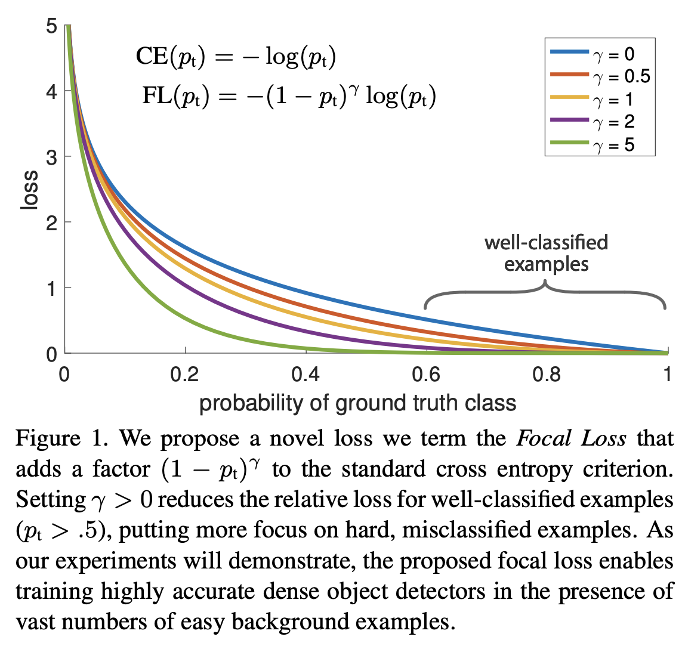

# Multi-class focal loss implemented with PyTorch

The focal loss is described in detail in the paper https://arxiv.org/abs/1708.02002

(Figure from https://arxiv.org/abs/1708.02002)

In a nutshell, it helps in dealing with datasets where some classes are
considerably harder to classify than others. A common reason for that problem is
an unbalanced dataset.

This loss has two hyperparameters, gamma and alpha. If you don't know which value
to use for **gamma**, try 2. The higher the gamma, the higher the "focus". If you use zero,
focal loss becomes the traditional cross-entropy.

Regarding the **alphas** (class-wise weights), from my experience with semantic segmentation, it is really worth it
to play around with them a bit. Start with an array of ones, and if needed, increase the alpha for under-represented classes.

This code was based on https://github.com/AdeelH/pytorch-multi-class-focal-loss but with some simplifications.
